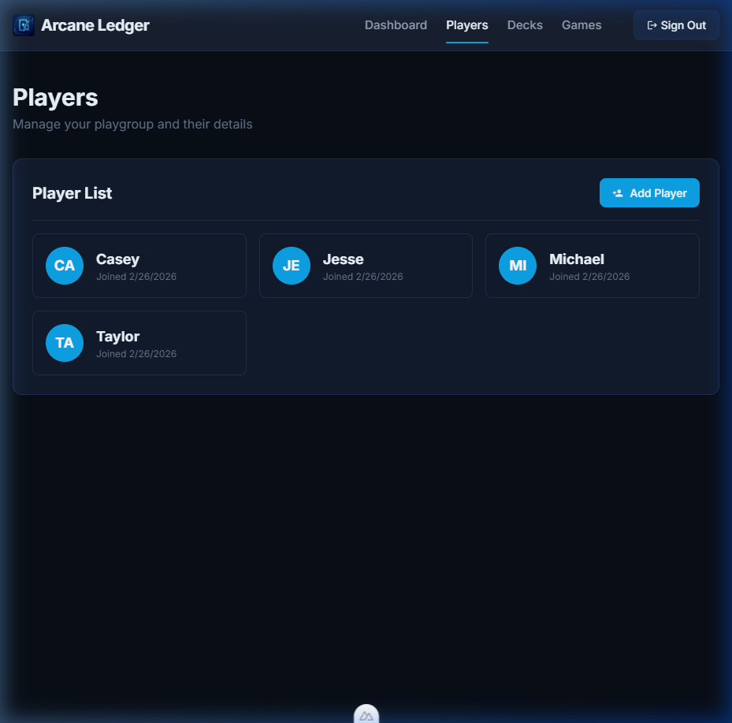
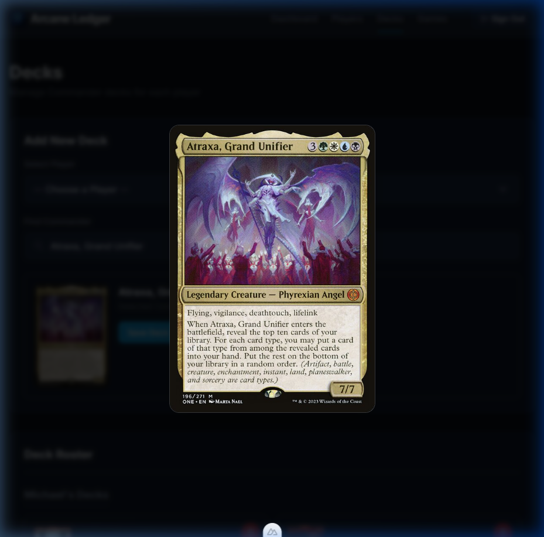
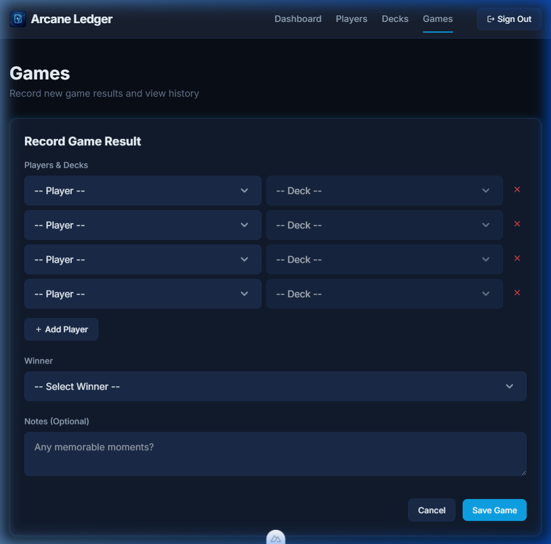

# Arcane Ledger - Application Scope & Guide

## Project Goal

**Arcane Ledger** is a premium, mobile-first web application designed specifically for Magic: The Gathering (MTG) Commander playgroups. Its primary goal is to provide a seamless, aesthetically pleasing interface for tracking players, managing their various Commander decks, and permanently recording game outcomes to track performance history over time.

Built on Nuxt 4, Vue 3, and styled with a custom "Abyssal/Arcane" Tailwind CSS theme, the application prioritizes a lightning-fast, highly visual user experience backed by a robust Supabase Postgres database.

---

## Core Features & Walkthrough

### 1. Dashboard & Navigation

The application features a dark-themed, glassmorphic layout.
**To Use:** Navigate seamlessly between the core sections using the top navigation bar (on Desktop) or the fixed bottom navigation bar (on Mobile). The dashboard (`/`) currently sets the stage for future overarching statistics.

### 2. Player Management (`/players`)

Before tracking games or decks, you must define the scope of your playgroup.
**To Use:**

- Navigate to **Players**.
- Click **Add Player** and type the name of a participant in your playgroup.
- Once saved, they immediately appear in your Player List roster with a generated monogram avatar.

### 3. Deck Management (`/decks`)

Each player can pilot multiple unique Commander decks. This section allows you to tie specific legendary creatures to specific people.
**To Use:**

- Navigate to **Decks**.
- Use the **Select Player** dropdown to choose the deck's owner.
- In the **Find Commander** search bar, type a legendary creature's name (e.g., "Atraxa" or "The Ur-Dragon"). The app reaches out to the official MTG Scryfall API and streams visual results to a dropdown menu.
- Click a result to preview the Commander art.
- _Pro Tip:_ Click the Commander art preview at any time to trigger a fullscreen "Hero" zoom animation.
- Click **Save Deck** to add it to the player's permanent roster.

**Managing the Roster:**
Decks are logically grouped by their player. By hovering over (or tapping) the right edge of a deck card, you can click the red 'X' icon to soft-delete a deck you no longer play. Note: Soft deleting removes it from your UI but preserves it safely in the database so previous game records don't break.

### 4. Game Tracking (`/games`)

The heart of Arcane Ledger. Here, you log the participants of a match and record the victor.
**To Use:**

- Navigate to **Games**, and click **Record Game**.
- Add between 2 and 6 participants to the match.
- For each participant, select the **Player** from the first dropdown. The second dropdown will automatically filter to only show **Decks** owned by that specific player.
- Select the **Winner** from the participants loop (or declare a Draw).
- Optionally, enter some **Notes** about the game (e.g., "Krenko went infinite on turn 4!").
- Click **Save Game**.

The result will instantly be appended to the Game History log, highlighting the winner with a golden crown icon, the date, and any contextual notes you provided.

